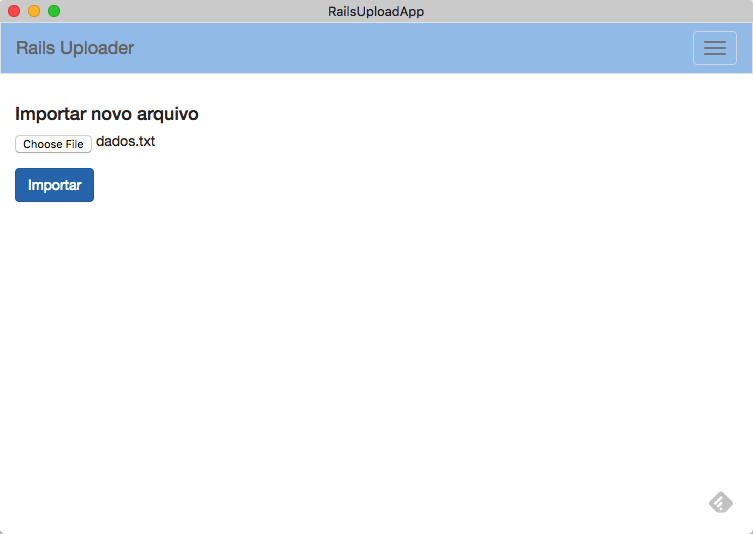
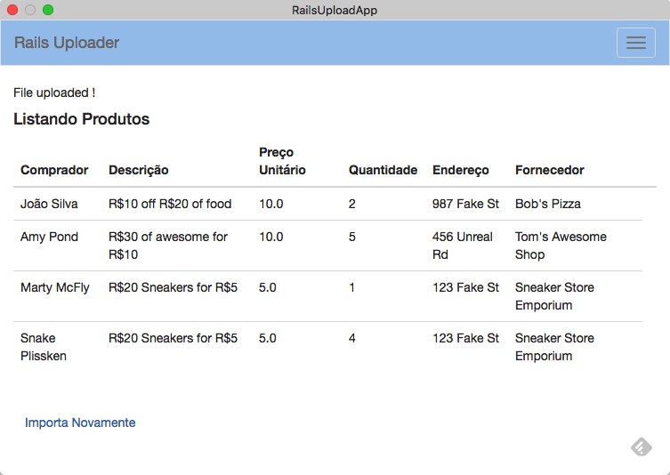

`

```
Roberto Nogueira  BSd EE, MSd CE
Solution Integrator Experienced - Certified by Ericsson
Rua Cel. Madeira, 42 Apto.22 - Centro
12245-760 - S. J. dos Campos - São Paulo - Brazil
Mobile : +55 (12) 98124-5001
Home   : +55 (12) 3207-6933
SkypeID: enogrob2005
Email  : enogrob@gmail.com
```

# Teste de Seleção Nexaas


## Introdução

Esta aplicação usa `Ruby 2.2.3@rails4.2`. Ela importa o arquivo no seguinte formato (veja abixo). 
Nota: Nenhuma livraria (p.e. Gem) em especial foi usado para fazer o upload do arquivo.

```
Comprador	descrição	Preço Uniário	Quantidade	Endereço	Fornecedor
João Silva	R$10 off R$20 of food	10.0	2	987 Fake St	Bob's Pizza
Amy Pond	R$30 of awesome for R$10	10.0	5	456 Unreal Rd	Tom's Awesome Shop
Marty McFly	R$20 Sneakers for R$5	5.0	1	123 Fake St	Sneaker Store Emporium
Snake Plissken	R$20 Sneakers for R$5	5.0	4	123 Fake St	Sneaker Store Emporium
```

### Instalação da Aplicação

1. Para instalar a aplicação deve ter instalado e configurado `git` e também `Ruby` e `Rails` nas versões:

* Ruby  2.2.3
* Rails 4.2.0 

```
$ git config -l
user.name=Roberto Nogueira
user.email=enogrob@gmail.com
:

$ rvm current
ruby-2.2.3@rails-4.2

$ ruby --version
ruby 2.2.3p173 (2015-08-18 revision 51636) [x86_64-darwin14]

$ rails --version
Rails 4.2.0
```

2. Enviar o comando a seguir para baixar o repositórion:

```
$ git clone https://github.com/enogrob/rails-upload-app.git
```

3. Mover para dentro o diretório criado:

```
$ cd rails-upload-app
```

4. Enviar os seguintes commandos para instalar as dependências necessárias e iniciar o `Rails`:

```
 $ bundle install
 $ rake db:migrate
 $ rails server
```

### Testes da Aplicação

```
$ rspec

Rails Upload App
  rq01
    Generate Rails application
      must have top level structure of a rails application
  rq02
    Product database structure in place
    Scaffolding generated
      must have at least one controller and views
    Products Model
      Products class
    Product class properties added
      should respond to #buyer
      should respond to #description
      should respond to #unit_price
      should respond to #amount
      should respond to #address
      should respond to #provider
      should respond to #created_at
      should respond to #updated_at
  rq03
    has the file that seeded the database
    must have Product as provided by seed file
  rq04
    products import URI should return a valid page
  rq05
    Checking uploaded file
      must have at least one dados.txt

Finished in 0.65152 seconds (files took 2.34 seconds to load)
16 examples, 0 failures
$
```
### Telas da Aplicação, de Upload e de listagem dos dados importados



